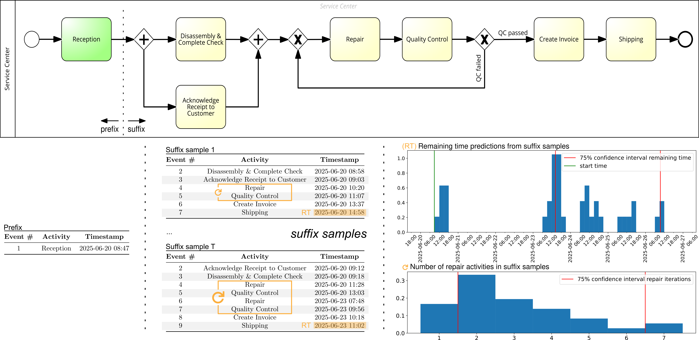

# Probabilistic Suffix Prediction of Business Processes

## Probabilistic Suffix Prediction Framework
We predict a probability distribution of suffixes of business processes using our own U-ED-LSTM and MC Suffix Sampling Algorithm.




## Setting Up the Python Environment with Pipenv

This project uses `pipenv` for managing Python dependencies. Follow the steps below to set up the virtual environment and install the necessary packages using the provided `Pipfile`.

### Prerequisites
Make sure you have Python and Pipenv installed.

### Setup Instructions

1. **Create the Virtual Environment**:
    
    ```bash
    pipenv install
    ```

2. **Activate the Virtual Environment**:
    
    ```bash
    pipenv shell
    ```

3. **Run the Project**: Inside the virtual environment, you have the Python packages installed for running the code.


## Run the Probabilistic Suffix Prediction Framework: Train and Evaluate.

- **data**: This folder contains the raw datasets.

- **encoded_data**: Stores the preprocessed datasets, which are used as inputs for the U-ED-LSTM training and for the evaluation.

- **evaluation_results**: Placeholder directory where suffix samples are stored.

- **src**: Contains the source code for the probabilistic suffix prediction framework:
    - ``src`` contains a directory ``notebooks`` with Jupyter notebooks that can be executed.
        - To pre-process load and encode a dataset, run the Jupyter notebooks in: ``src/notebooks/loader_notebooks/xxx``.
        - To train a U-ED-LSTM model on a preprocessed dataset run: ``src/notebooks/training_variatinal dropout/xxx`` or ``src/notebooks/training_variational_dropout_log_normal/xxx``.
        - To sample suffixes using a trained U-ED-LSTM model on the test data sets, run: ``src/notebooks/evaluation_run_notebooks/xxx``
        - To evaluate the samples run: ``src/notebooks/evaluation_metric_notebooks/xxx``.
     
### Data Encoding

We provide two different data encoding approaches, differing in how the continuous data is encoded:
For the ``log_normal`` notebooks, the non-negative attributes (such as case_elapsed_time) are logarithmized before they are encoded.
For the other notebooks, these attributes are encoded directly.

### Training

There is already a trained version of the U-ED-LSTM for each dataset, located in the directory: ``src/notebooks/training_variational_dropout/xxx`` or ``src/notebooks/training_variational_dropout_log_normal/xxx``.

### Evaluation (Sampling)

Drawing samples for all prefixes in the test set can take some time (e.g., the BPIC-17 test data set has 174.065 prefixes).
Additionally, storing the samples can require considerable amounts of memory: Storing 1.000 MC samples per prefix for the BPIC-17 data set takes around 720 GB.

Since most U-ED-LSTM models are relatively small, we noticed that sampling works faster on recent CPUs (e.g., AMD Ryzen 9 7950X) than on recent GPUs (e.g., NVIDIA GeForce RTX 4090).

You should adjust the ``num_processes`` value to your CPU / RAM and the ``save_every`` variable to your RAM.
The ``save_every`` variable saves the samples for every n-th prefix. We use pickle to save the samples, which requires enormous amounts of RAM. Consider decreasing that value when your RAM is limited.

### Evaluation (Metrics)

The ``evaluation_metric_notebooks`` use multiprocessing to load the suffix sample pickle files. Again, this can take massive amounts of RAM. Consider decreasing the ``num_workers`` variable when your RAM is limited.
By default, the plots are created as PGF files for LaTeX, requiring that you have a LaTeX distribution installed.